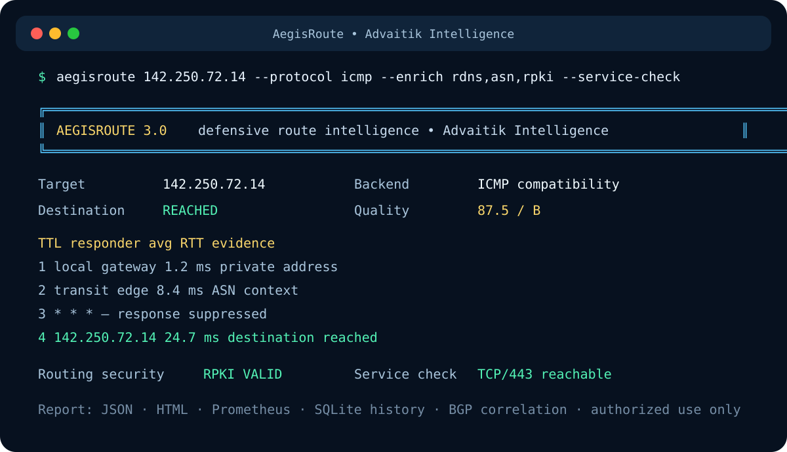

# AegisRoute

> **Defensive route intelligence for the data plane and the control plane.**

Built by **Advaitik Intelligence**, AegisRoute is a Linux-first CLI for evidence-led route measurement, routing-security context, and repeatable path analysis. It combines native traceroute data with optional BGP/RPKI, IXP, ASN, service, history, and multi-vantage evidence—without turning a network diagnostic into a scanner.



## What it does

AegisRoute answers the operational questions a classic traceroute cannot answer on its own:

- **Where did the traffic go?** Concurrent ICMP, UDP, and TCP path measurements with per-hop RTT, jitter, loss, ECMP responders, loops, silent hops, and latency jumps.
- **Who operates the route?** Optional reverse DNS, ASN/prefix, geolocation, RPKI, and IXP-LAN context, with timeouts and cache-aware enrichment.
- **Does control-plane evidence agree?** Optional BGP events and origin-AS observations are attached to the measured route rather than reported as an unrelated lookup.
- **Is it useful in an investigation?** JSON, JSONL, CSV, Prometheus, and standalone HTML reports; SQLite/WAL history; baseline diffs; alert hooks; and a read-only remote report agent.

The tool probes only one user-supplied destination with bounded TTL-limited diagnostics. It is designed for authorized troubleshooting, network operations, and defensive research—not scanning, exploitation, or evasion.

AegisRoute 3.0 is a Linux-first route intelligence and distributed path-observability tool for network troubleshooting, defensive security research, and repeatable measurement. It runs native Linux `traceroute`, can drive CAIDA Scamper for Paris/MDA/Ally measurements, correlates data-plane paths with BGP control-plane events, and produces evidence-backed reports.

Windows can also run real targets through an automatic ICMP `tracert.exe` compatibility backend. Every protocol choice produces a real trace instead of failing, and the report identifies both the requested mode and actual ICMP backend. True TCP/UDP packet semantics, flow pinning, interface binding, IPv4 source binding, custom probe counts, and MTU discovery remain Linux-only.

The CLI includes a colorful branded dashboard, four selectable themes, and a guided menu for users who prefer choosing options instead of remembering flags. The default company brand is **Advaitik Intelligence** and remains configurable.

It is intentionally more than a prettier traceroute:

- UDP, TCP, and ICMP traces can run concurrently.
- Per-hop loss, minimum/average/maximum RTT, and jitter are calculated.
- Multiple responders at one TTL expose ECMP or load-balanced paths.
- Flow-consistent mode pins ports where the installed traceroute supports it (Paris-inspired, not a full Paris Traceroute implementation).
- Optional reverse DNS, Team Cymru ASN/prefix, and IPWho geolocation enrichment runs concurrently with strict timeouts.
- Private/link-local/loopback/reserved hops are labeled locally and are never sent to public enrichment services.
- Route loops, silent hops, ICMP annotations, latency jumps, incomplete paths, and cross-protocol divergence are highlighted.
- A saved JSON report can be used as a baseline for route-change detection.
- Table, JSON, JSON Lines, and CSV outputs support both humans and automation.
- Watch mode emits time-series JSONL and compares each run with the previous route.
- MTU discovery and Linux traceroute extension/MPLS output are enabled when the local implementation supports them.
- No Python packages are required.
- The v3 fusion graph correlates routers and transitions across protocols, saved reports, remote agents, or RIPE Atlas probes.
- Findings carry confidence, evidence, and alternative explanations instead of presenting weak signals as facts.
- RIPEstat adds RPKI validation and routing visibility; PeeringDB can identify IXP LAN prefixes.
- Existing public RIPE Atlas traceroute measurements can be normalized without creating a measurement or spending credits.
- SQLite WAL history stores route fingerprints and indexed findings; Prometheus text output integrates with monitoring.
- Optional Scamper strategies provide real Paris flow stability and genuine 95%/99% MDA discovery.
- RIPEstat BGP-event correlation reports announcements, withdrawals, and observed origin ASNs.
- Consecutive SQLite measurements automatically detect responder, latency, loss, and RPKI-state changes.
- Persistent enrichment caching survives restarts and reduces external API traffic.
- TCP and verified TLS diagnostics separate route reachability from service reachability.
- RFC 5837 interface information, MPLS timelines, and external TNT captures are normalized when present.
- Scamper Ally can actively confirm bounded router-alias candidates; heuristics are never presented as confirmation.
- Standalone HTML investigation reports, live redraw mode, quality scores, webhooks, SMTP alerts, and a read-only remote agent are included.

## Designer CLI

Start the guided selection menu by running AegisRoute without a target in an interactive terminal:

```bash
aegisroute
```

Or request it explicitly:

```bash
aegisroute --interactive
```

The menu lets you select the target, probe strategy, destination port, enrichment level, output format, and flow-consistency behavior.

For research-grade path discovery (Linux with Scamper installed):

```bash
aegisroute 1.1.1.1 --strategy paris --protocol udp
aegisroute 1.1.1.1 --strategy mda --protocol udp --mda-confidence 95
```

Full AegisRoute 3.0 investigation:

```bash
aegisroute example.com --protocol all --enrich rdns,asn,geo,rpki,ixp \
  --bgp-events --service-check --tls-check --store routes.db \
  --format html --output investigation.html
```

`mda` is intentionally not emulated by ordinary traceroute. If Scamper is unavailable, AegisRoute exits with an installation hint. With `--protocol all`, MDA uses UDP once to avoid accidentally launching three expensive topology-discovery runs.

Available visual themes:

```bash
aegisroute example.com --theme cyber
aegisroute example.com --theme ocean
aegisroute example.com --theme amber
aegisroute example.com --theme mono
```

Set your company name for one run or for every run:

```bash
aegisroute example.com --company "Example Security Operations"
export AEGISROUTE_COMPANY="Example Security Operations"
```

Use `--no-color` for log collectors and terminals without ANSI color support. Structured JSON reports also include the configured company name.

Preview the complete dashboard and analysis pipeline without sending any packets:

```bash
aegisroute --demo
aegisroute --demo --company "Example Security Operations" --theme ocean
```

## Install

```bash
git clone <your-copy-of-this-directory> aegisroute
cd aegisroute
chmod +x aegisroute install.sh uninstall.sh
./install.sh
```

The installer supports Debian/Ubuntu, Fedora/RHEL, Arch, openSUSE, and Alpine package managers. It installs only the native `traceroute` package when needed, then places AegisRoute under `/usr/local`. Set `PREFIX` for a different location.

Scamper is optional. Install the distribution's `scamper` package when you need `--strategy paris` or `--strategy mda`; classic mode has no Python package dependency.

The installer also registers the complete Linux manual. After installation:

```bash
man aegisroute
aegisroute -h
aegisroute --doctor
```

`man aegisroute` documents the measurement model, every option, privacy behavior, findings, privileges, files, environment variables, exit statuses, and examples. `aegisroute -h` provides the same essential definitions and common workflows directly in the CLI. `--doctor` checks Linux, Python, the traceroute backend, supported backend flags, and effective privileges.

Run without installing:

```bash
chmod +x aegisroute
./aegisroute example.com
```

On Windows, from PowerShell inside the source directory:

```powershell
python .\aegisroute.py 8.8.8.8 --no-enrich
python .\aegisroute.py example.com --protocol icmp
```

Use the exact filename `aegisroute.py`.

## Examples

Fast three-protocol trace with ASN and reverse DNS context:

```bash
aegisroute example.com
```

Trace a service the way a firewall is likely to see it:

```bash
aegisroute example.com --protocol tcp --port 443 --flow-consistent
```

Add location enrichment and save a machine-readable report:

```bash
aegisroute 1.1.1.1 --enrich rdns,asn,geo --format json --output trace.json
```

Monitor every 30 seconds, compare consecutive routes, and append JSONL:

```bash
aegisroute example.com --watch 30 --format jsonl --output route-history.jsonl
```

Compare with a previous JSON report:

```bash
aegisroute example.com --format json --compare baseline.json
```

Avoid external lookups entirely:

```bash
aegisroute example.com --no-enrich
```

Add routing-security and exchange context, persist the report, then query history:

```bash
aegisroute 8.8.8.8 --enrich rdns,asn,rpki,ixp --store routes.db --format json
aegisroute 8.8.8.8 --store routes.db --history 20
```

Import and normalize an existing public RIPE Atlas measurement:

```bash
aegisroute --atlas-id 12345678 --store routes.db
aegisroute --atlas-ids 12345678,23456789 --store routes.db
```

Fuse local, saved, and remote vantage reports:

```bash
aegisroute example.com --merge-report branch-office.json \
  --remote-report https://probe.example.net/report --format json --output fused.json
```

Run a read-only remote agent. Generate the report on a timer, then place the agent behind an authenticated TLS reverse proxy:

```bash
aegisroute example.com --format json --output /var/lib/aegisroute/latest.json
export AEGISROUTE_AGENT_TOKEN='replace-with-a-long-random-token'
aegisroute-agent --report /var/lib/aegisroute/latest.json --listen 127.0.0.1 --port 8787
```

Generate a live console, BGP correlation, and service diagnostics:

```bash
aegisroute example.com --watch 30 --tui --bgp-events --service-check --tls-check --store routes.db
```

Actively test a small number of likely router aliases with Scamper Ally:

```bash
sudo aegisroute example.com --strategy mda --alias-resolve --alias-max-pairs 5
```

Import a capture produced by the external TNT research engine:

```bash
aegisroute example.com --tnt-output tnt-capture.txt --format html --output mpls-report.html
```

Send thresholded alerts. SMTP credentials are read from `AEGISROUTE_SMTP_PASSWORD`:

```bash
aegisroute example.com --store routes.db --webhook https://hooks.example.net/aegisroute
aegisroute example.com --email-to noc@example.net --email-from aegisroute@example.net \
  --smtp-host smtp.example.net --smtp-user aegisroute
```

Export metrics for a Prometheus node-exporter textfile collector:

```bash
aegisroute 1.1.1.1 --protocol icmp --no-enrich --format prometheus --output aegisroute.prom
```

Hardened example systemd service/timer files are in `contrib/`; copy and review them rather than enabling them blindly.

Preview the exact commands without probing:

```bash
aegisroute example.com --dry-run
```

## Exit codes

- `0`: at least one requested trace ran successfully.
- `2`: invalid input, missing dependency, resolution failure, or all trace modes failed.
- `130`: interrupted by the user.

An incomplete route is reported as a finding, not automatically treated as a process failure: routers commonly rate-limit or suppress TTL-expired messages.

## Performance design

Packet probing remains in the optimized system `traceroute` binary. Protocol runs are launched concurrently. Reverse DNS and opt-in geolocation use bounded concurrency, and ASN data is fetched for all public hop addresses in one Team Cymru bulk WHOIS connection. Every external operation has a timeout. The default one-second response window can be changed with `--wait`.

## Enrichment and privacy

The default `rdns,asn` setting performs DNS PTR lookups and submits public hop addresses in a bulk query to `whois.cymru.com`. Adding `geo` sends each public hop address to `ipwho.is`; `rpki` submits public prefix/ASN pairs to RIPEstat; `ixp` checks public hop addresses against PeeringDB IXP LAN prefixes. Use `--no-enrich` for offline/private assessments. Public services may rate-limit requests and their answers are informative, not authoritative.

## Privileges

Linux distributions differ. UDP often works as an ordinary user; TCP and ICMP may require root or capabilities. Prefer the narrowest capability your distribution documents for its packaged traceroute binary. Do not add setuid or capabilities to the Python script.

## Responsible use

AegisRoute sends ordinary TTL-limited diagnostic probes to one explicitly supplied destination. Use it only on networks and targets you are permitted to measure. It is not a port scanner, vulnerability scanner, evasion tool, or traffic flooder. Conservative bounds are enforced for probes, hops, timeouts, and enrichment concurrency.

## Tests

The parser tests do not touch the network:

```bash
python3 -m unittest discover -s tests -v
```

For a live smoke test on Linux:

```bash
./aegisroute 127.0.0.1 --protocol icmp --no-enrich --max-hops 3
```

## Design references

AegisRoute was independently implemented and does not copy source from these projects. The feature study drew on:

- [Trippy](https://github.com/fujiapple852/trippy) for combined ping/traceroute statistics and flow-aware probing concepts.
- [NextTrace](https://github.com/nxtrace/NTrace-core) for visual route/ASN context and multiple probe protocols.
- [scamper](https://github.com/CAIDA/scamper) for research-oriented measurement and structured results.
- [Paris Traceroute](https://github.com/libparistraceroute/libparistraceroute) for the principle of controlling flow identifiers when measuring load-balanced paths.
- [MTR](https://github.com/traviscross/mtr) for continuously updated per-hop loss and latency statistics.

Those tools remain excellent choices. AegisRoute's niche is a dependency-light Python/Bash workflow with concurrent cross-protocol correlation, enrichment, baseline diffs, and automation-friendly reports.

See `ARCHITECTURE.md` for backend boundaries, evidence semantics, data contracts, and threat-model notes.

## License

MIT. See `LICENSE`.
